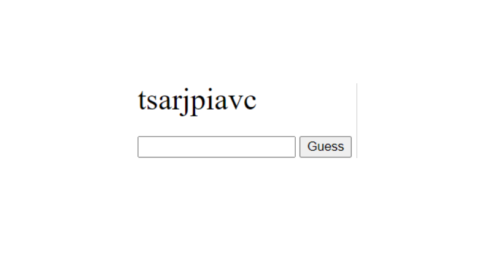
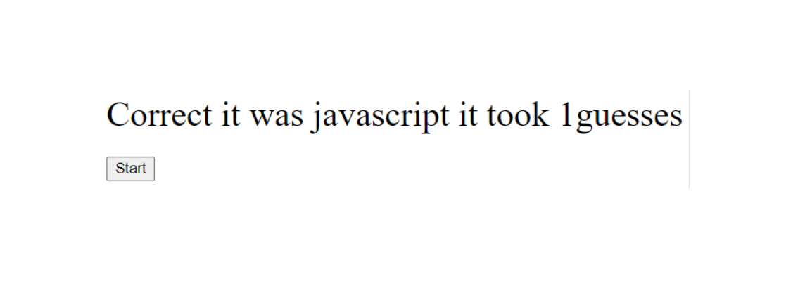

# Word-Scramble: Guess-The-Word
JavaScript arrays - randomize array contents Element selection and manipulation of DOM content. Simple random word scramble - check if the input matches the random word.

# Features
-document.querySelector().
-const myArray = ["javascript", "website", "html", "document", "course", "new"];
-button.addEventListener("click", function () {
-guess.classList.toggle("hidden");
-randomArray(scramble.split("")).join("");
-Math.floor(Math.random() * myArray.length);
-for (let i = arr.length - 1; i > 0; i--) {

# Images

